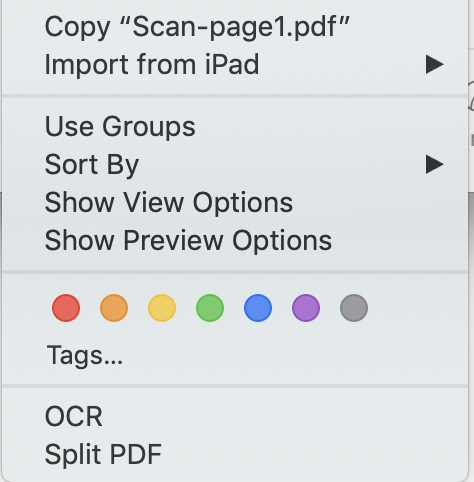
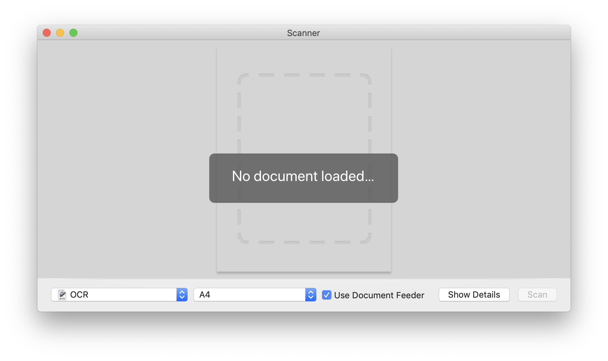

# Mac PDF Automations

Some automator scripts to make your PDF workflow easier on MacOS.

# Installation
* Install [OCRmyPDF](https://github.com/jbarlow83/OCRmyPDF)
    * Install [Homebrew](https://brew.sh/)
    * `brew install ocrmypdf`
* [Download this repo](https://github.com/jinziqi/mac-pdf-automations/archive/master.zip)

# Workflows

## Services/OCR.workflow

Quick action to apply OCR on scanned PDF

## Services/Split PDF.workflow

Quick action that creates single-page PDF documents from each page of an input PDF document

## Image Capture Plugins/OCR.workflow

Apply OCR on scanned PDF right from the scanner window

